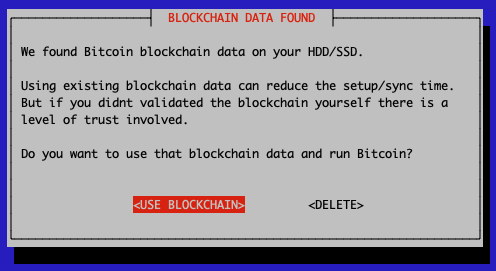
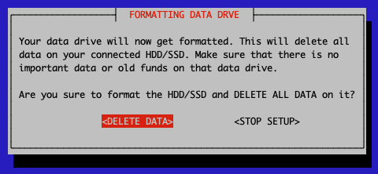
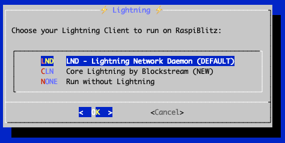
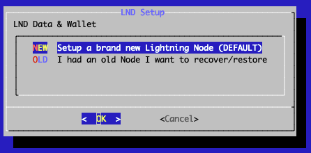
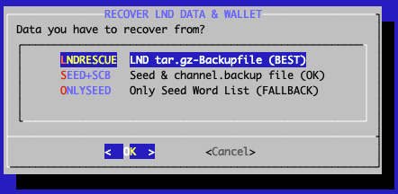

# Basic Setup

Every time you start with a fresh SD card image you will be offered different options.
For example this is also the point where you can import a Migration file from an older RaspiBlitz - read about Migration.
But because you are setting up a brand new RaspiBlitz you will choose here `FRESHSETUP`.

Then you will be asked what to do with the connected hard drive/SSD.

If there is already a blockchain on your hard drive/SSD you will be asked if you want to use this pre-synced/validated data or if its OK to delete it.
If there is no blockchain data this question will be skipped.

Finally you have to agree that all (other) data on the hard drive/SSD will be deleted, except the blockchain if you selected that previously.
This might take some seconds.

First thing to setup is giving your RaspiBlitz a name:

The name you choose for your RaspiBlitz will also be used as your public alias of your lightning node so choose wisely.

Then you can choose which Lightning implementation you want to run on top of your Bitcoin Fullnode.
RaspiBlitz started with `LND` from Lightning Labs which is used by most other Raspberry Pi lightning nodes and works with most additional apps.
But you can now also choose `CL` for Core Lightning by Blockstream which is a good choice for more experienced node operators & lightning developers that want to use the highly customizable plugin structure that Core Lightning offers.

It's also possible to use both lightning node implementations in parallel on your RaspiBlitz later on - just pick one to start with for now.

Choose `NONE` if you're only interested in running a Bitcoin full node without Lightning.

:::info
In the following we show the setup with LND - which is very similar to the steps with Core Lightning.
:::

If you chose to use one of the lightning implementations you will now be asked if you want to start a `NEW` wallet/lightning node or if you have an `OLD` lightning wallet/node that you want to re-create.

Normally you just chose `NEW` here, but to recover an old wallet you have the following options if you choose `OLD`:

You have the following options to recover an old node.

#### Import a Migration File

As mentioned above you can export a Migration File from your RaspiBlitz with `MAINMENU > REPAIR > MIGRATION` and store it on your laptop.

A Migration file contains all the important data from your RaspiBlitz, like your LND data, Bitcoin Wallet, raspiblitz.config, Tor/SSH keys, and also installed apps.
You can use this to migrate your RaspiBlitz to new hardware.

If you want to import it again to a new RaspiBlitz (for example with an updated HDD/SSD), you can choose the `FROMBACKUP` option on the first setup dialogue of a fresh SD card image.

If you start MIGRATION you be get asked whether you would like to use a existing blockchain on the hard drive/SSD and delete the rest, or whether you'd prefer to format the entire drive.
Once that's done you are shown instructions on how to upload the migration file (use the password `raspiblitz` when asked on executing the upload command):

After this you will be asked to set a new password A, and your RaspiBlitz will go into recovery/provision process.
Then RaspiBlitz might give you the option again to self-sync or copy the blockchain from another computer/blitz, and afterwards a final reboot.

Then the blockchain needs to sync up and you should be back to normal.

#### LNDRESCUE

:::info
This is the preferred choice
:::

Choose this option if you have made a complete backup of the LND or Core Lightning data and have a tar.gz file starting with the word 'lnd-rescue' or 'cl-rescue' available.
It will recover all your on-chain funds and open channels you had.
But you have to make sure that the rescue backup you have is really the latest version - otherwise you might lose channel funds.

_If you have tar.gz file that starts with 'raspiblitz', that's a migration file.
That also includes your old LND/Core Lightning wallet, but you import that file at the beginning of the setup process with 'FROMBACKUP - Upload Migration Backup' instead choosing FRESHSETUP_

#### SEED+SCB Words Seed & channel.backup file (OK)

:::info
This is the second best option if LNDRESCUE is not available
:::
The next best option is if you have the channel.backup file and the word list seed.
This allows you to recover all on-chain funds (i.e. "bitcoin balance") in the lightning wallet, and gives you a good chance of recovering the off-chain funds (i.e. "lightning balance") you had in open channels, as long as the remote peer supports `option_data_loss_protect` which is very common since 2020.
All channels you had open before will be closed during this procedure.
See [Bitcoin Optech - Static Channel Backups](https://bitcoinops.org/en/topics/static-channel-backups/) for more background information on this process.

#### ONLY SEED Only Seed Word List (Fallback)

:::info
This option should only be used if all off the above options fail.
:::
If you only have the seed word list (RaspiBlitz 1.1 and older) you can at least try to recover your on-chain funds.
Recovery of channel funds is not very likely in this scenario.

But normally you are setting up a new node - so simply choose `NEW` in the menu.
